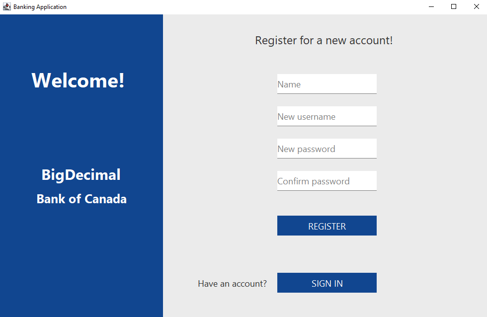
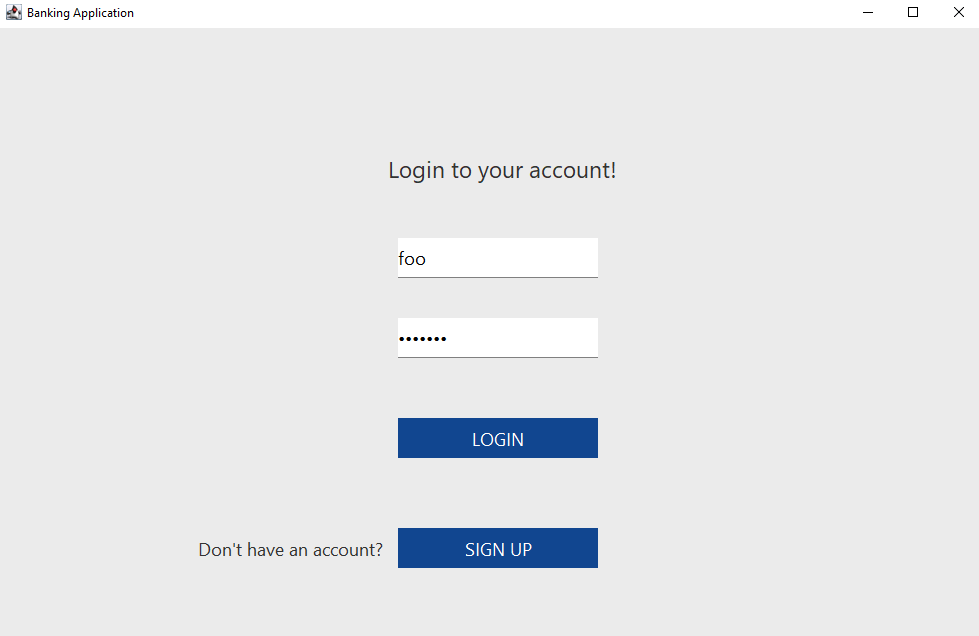
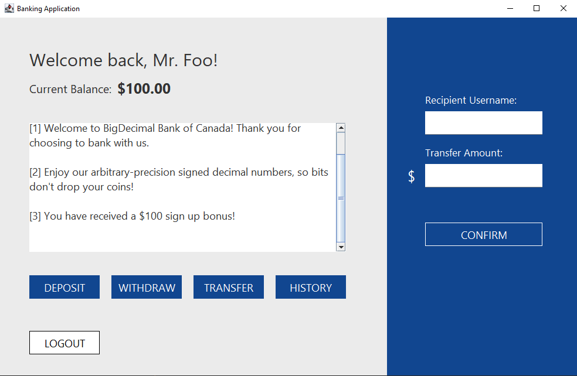
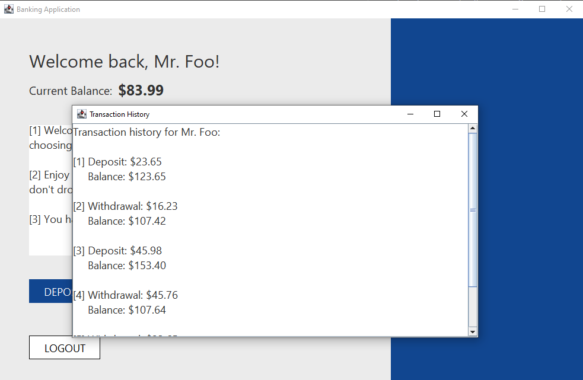
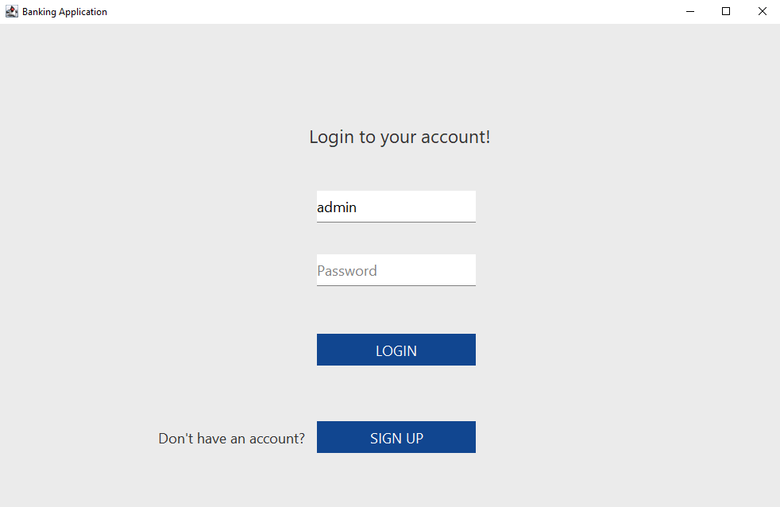
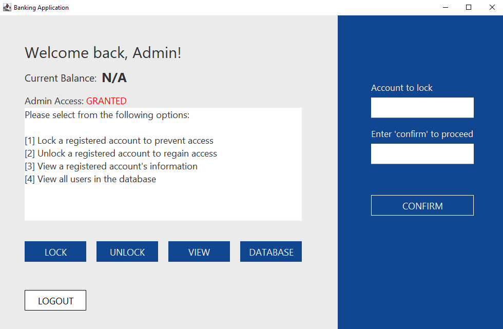
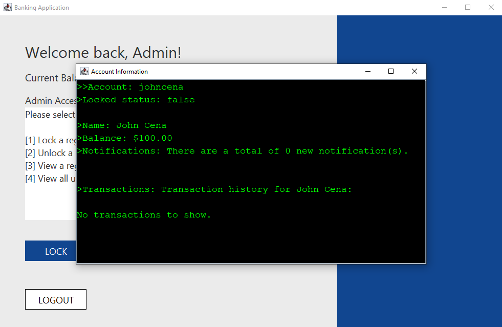
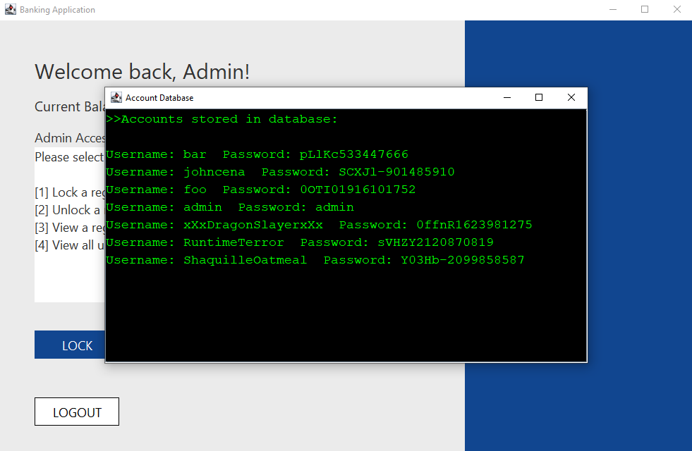

# Secure Banking Application  

---

[](https://gitlab.com/pat-ok/secure-banking-application/-/commits/master)

[](https://github.com/feross/standard)

### Better than your average banking app.
[Features](#why-bank-with-us?) | [Get Started](#getting-started) | [Usage](#usage-examples) | [Additional Info](#faq)

---


### Why bank with us?
Sure, any banking app might also allow you to create an account and deposit or withdraw money from it. Maybe you can even transfer 
money to other users. But here are some features you *don't* see in every other app:
* Accounts secured with passwords that are [salted and hashed](#what-is-salting-and-hashing).
* Transactions history for when you wonder *where did all your money go?!* (Hint: you spent it)
* Automatic notifications for eTransfers. Who *doesn't* love seeing the words "You've received money from..."?
* [Admin access](#accessing-the-admin-account) for freezing accounts and viewing database information.
* All transactions performed using [BigDecimal objects](#what-is-bigdecimal) - and *no, those are not just decimals that are big.*
* Optional data persistence, for when you want to save your activity (or not).

---
### Getting Started
1. Download the latest release [here](https://github.com/pat-ok/secure-banking-application/archive/refs/heads/master.zip).
2. Extract `secure-banking-application-master` and [open a terminal](https://www.groovypost.com/howto/open-command-window-terminal-window-specific-folder-windows-mac-linux/) inside the folder.
3. Ensure you have [Java](https://java.com/en/download/manual.jsp) installed. Then copy and paste this into the terminal:
```shell
java -cp target/classes ui.Main
```
4. That's it. Thanks for checking it out!

---
### Usage Examples
[Registration](#registering-for-an-account) | [Login](#logging-in) | [Admin Access](#accessing-the-admin-account)
##### Registering for an account
Register for an account on the home page of the app, with a name, username, and a password. Please
note that the username and password must not have leading or trailing spaces.



#### Logging in
Log in to your account via the login page. From there, you can deposit, withdraw, or transfer money to other
users. You may also view your activity history.



  

#### Accessing the admin account
Admin account can be accessed with the username `admin`, with no password required. Admins can lock or unlock accounts,
view specific account information, or have an overview of all accounts.  






---
### FAQ
#### Why was this project of interest?
Object-oriented programming is pretty cool. This is my first app, so I'm just learning the basics. Things like:  
- Designing a program in an object-oriented domain using a test driven development process.
- Creating a robust exception handling system to maintain desired flow of program. 
- Optimizing data abstraction to more accurately model the domain and limit points of reliance with appropriate levels of access.  
- Developing a well documented and maintainable codebase.

#### What is salting and hashing?
Lightly salted hash browns are great. Salted and hashed passwords are even greater. Hashing essentially means scrambling 
your password into a random value, and the clear text is never stored. This way, hackers who see the database might see
the scrambled value, but they'll never guess your real password. Hashing is repeatable, so every time you login, your
password is rehashed, and it should produce the same scrambled value if correct.

Salting is simply adding random characters to your password before it gets hashed, so that those with the same passwords
do not end up with the same scrambled value. As a visualization, all the passwords below were registered using `pass123`.
```
Username: user0    Password: pLlKc533447666
Username: user1    Password: gyVXX1828114549
Username: user2    Password: sEmGg307362738
```

#### What is BigDecimal?
[BigDecimal](https://docs.oracle.com/javase/7/docs/api/java/math/BigDecimal.html) is an exact way for Java to represent 
numbers. While other data types such as [floats](https://docs.oracle.com/javase/7/docs/api/java/lang/Float.html)
or [doubles](https://docs.oracle.com/javase/8/docs/api/java/lang/Double.html) have fixed precision, meaning they
have a certain number of representable digits in an unscaled value, BigDecimal has *arbitrary* precision. This is because
floats and doubles will store the entire value in [binary notation](https://en.wikipedia.org/wiki/Binary_number),
but BigDecimal will store *each digit* with binary notation. When differences in magnitude between numbers grows
too large, rounding errors are bound to happen with fixed precision. This is why the arbitrary precision of BigDecimal
makes it a safe choice to calculate currencies in - you don't want to lose money due to rounding errors!
